# Docker

1. Instala docker en una máquina y configúralo para que se pueda con un usuario sin privilegios.

   ```bash
   apt install ca-certificates curl gnupg lsb-release
   ```

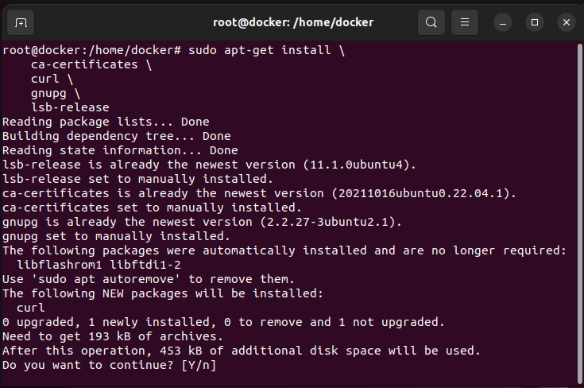

```bash
sudo mkdir -p /etc/apt/keyrings
```

```bash
curl -fsSL https://download.docker.com/linux/ubuntu/gpg | sudo gpg --dearmor -o /etc/apt/keyrings/docker.gpg
```

```bash
echo \
  "deb [arch=$(dpkg --print-architecture) signed-by=/etc/apt/keyrings/docker.gpg] https://download.docker.com/linux/ubuntu \
  $(lsb_release -cs) stable" | sudo tee /etc/apt/sources.list.d/docker.list > /dev/null
```

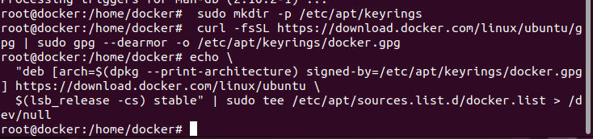

```bash
sudo apt-get install docker-ce docker-ce-cli containerd.io docker-compose-plugin
```

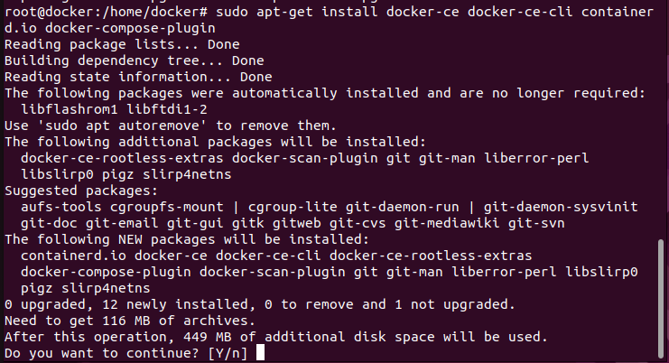

2. Ejecuta un contenedor a partir de la imagen hello-word. Comprueba que nos devuelve la salida adecuada. Comprueba que no se está ejecutando. Lista los contenedores que están parado. Borra el contenedor.

   ```bash
   sudo docker run hello-word
   ```

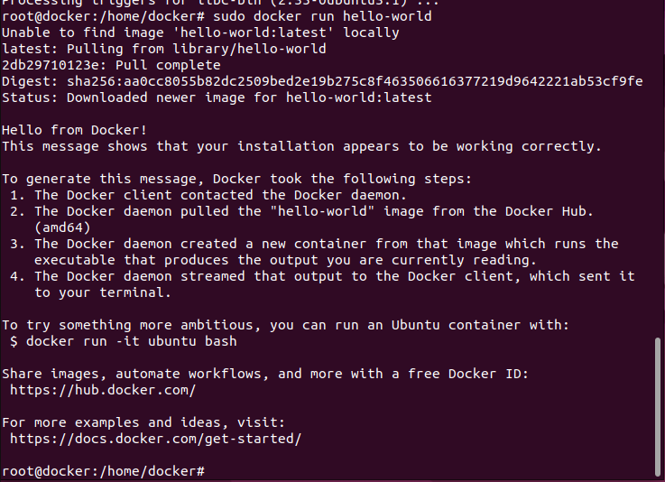

3. Crea un contenedor interactivo desde una imagen debian. Instala un paquete (por ejemplo nano). Sal de la terminal, ¿sigue el contenedor corriendo? ¿Por qué?. Vuelve a iniciar el contenedor y accede de nuevo a él de forma interactiva. ¿Sigue instalado el nano?. Sal del contenedor, y bórralo. Crea un nuevo contenedor interactivo desde la misma imagen. ¿Tiene el nano instalado?

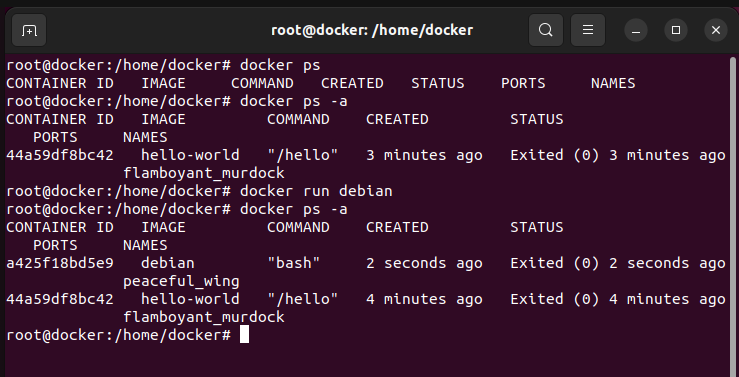

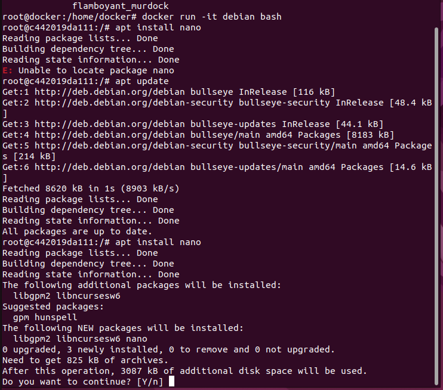

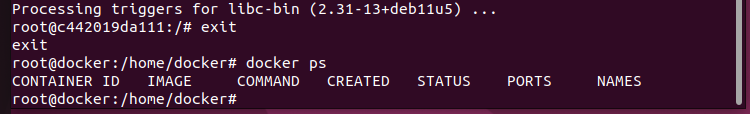

El contenedor no sigue corriendo, ya que con el run -it al salir, se cierra directamente. Al volver a ejecutarlo, el paquete nano no esta instalado ya que se crea un nuevo contenedor.

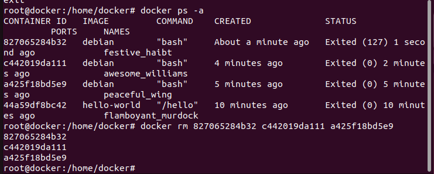

4. Crea un contenedor demonio con un servidor nginx, usando la imagen oficial de nginx. Al crear el contenedor, ¿has tenido que indicar algún comando para que lo ejecute? Accede al navegador web y comprueba que el servidor esta funcionando. Muestra los logs del contenedor.

   ```bash
   docker pull nginx
   ```

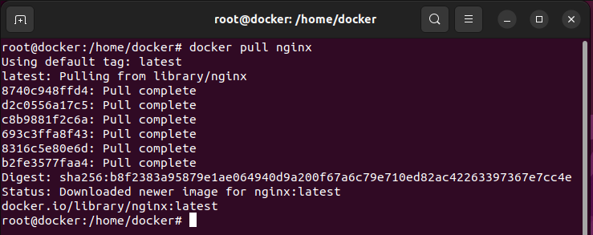

Para ejecutarlo, hay que ejecutar el siguiente comando:

```bash
docker run nginx
```

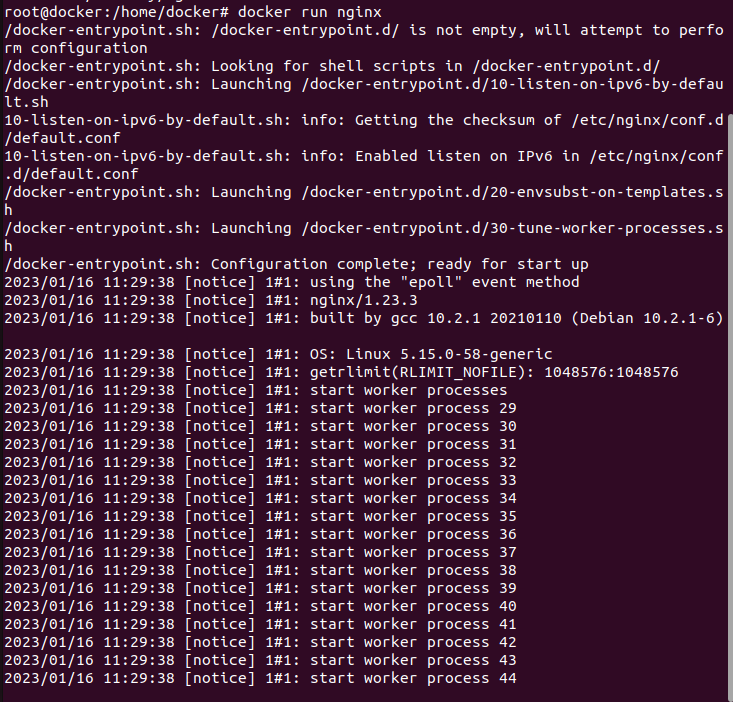

Para ver la IP del docker, se hace el siguiente comando:

```bash
docker inspect id_contenedor
```

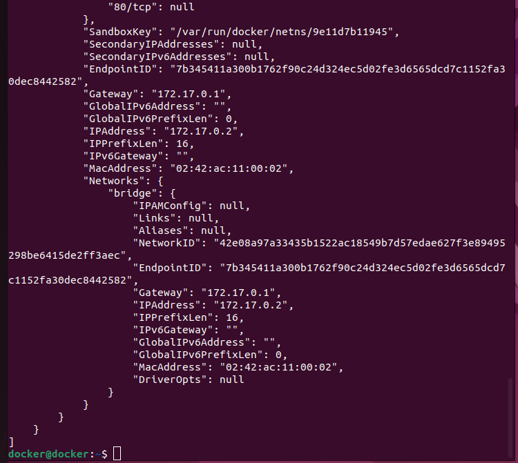

Y el resultado final, es este:

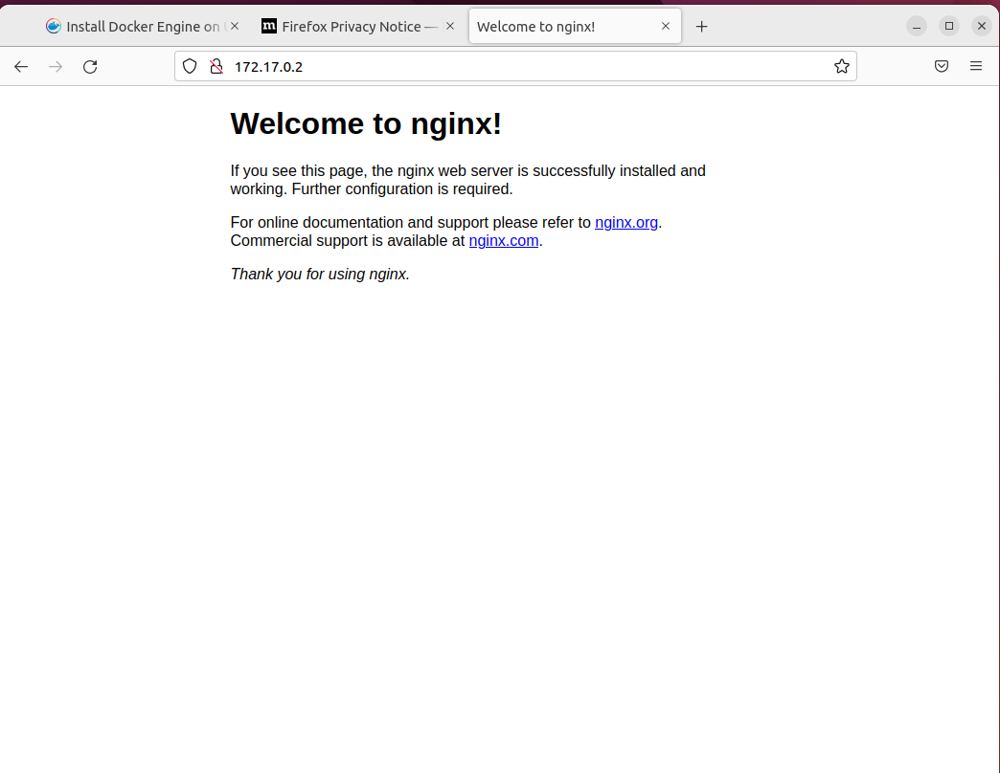
