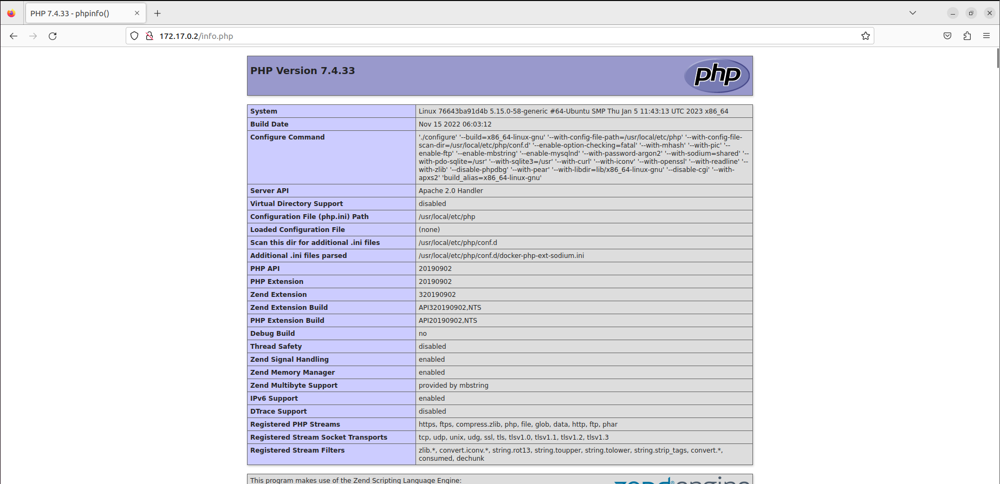

# Docker

1. Descarga las siguientes imágenes: ubuntu:18.04, httpd, tomcat:9.0.39-jdk11,jenkins/jenkins:lts, php:7.4-apache.

   ```bash
   docker pull ubuntu:18.04
   docker pull httpd
   docker pull tomcat:9.0.39-jdk11
   docker pull jenkins/jenkins:lts
   docker pull php:7.4-apache
   ```

   

   

2. Muestras las imágenes que tienes descargadas.

```bash
docker images
```


3. Crea un contenedor demonio con la imagen php:7.4-apache.

```bash
docker run -d --name apache php:7.4-apache
```


4. Comprueba el tamaño del contenedor en el disco duro.

```bash
docker ps -a -s
```


5. Con la instrucción docker cp podemos copiar ficheros a o desde un contenedor. Puedes encontrar información es esta página. Crea un fichero en tu ordenador, con el siguiente contenido:

   ```php
   <?php
       echo phpinfo();
   ?>
   ```

   

   Copia un fichero info.php al directorio /var/www/html del contenedor con docker cp.

```bash
docker cp info.php apache:/var/www/html
```


6. Vuelve a comprobar el espacio ocupado por el contenedor.

   ```bash
   docker ps -a -s
   ```

   

7. Accede al fichero `info.php` desde un navegador web.

