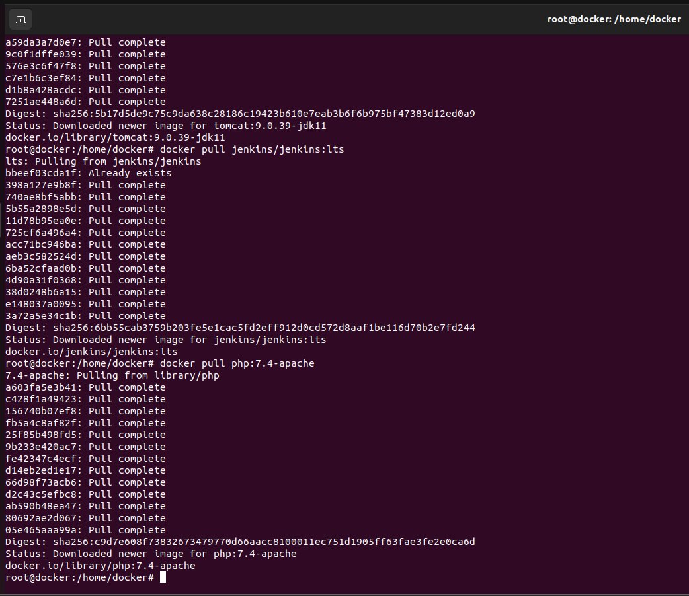

# Docker

1. Descarga las siguientes imágenes: ubuntu:18.04, httpd, tomcat:9.0.39-jdk11,jenkins/jenkins:lts, php:7.4-apache.

   ```bash
   docker pull ubuntu:18.04
   docker pull httpd
   docker pull tomcat:9.0.39-jdk11
   docker pull jenkins/jenkins:lts
   docker pull php:7.4-apache
   ```

   

   

2. Muestras las imágenes que tienes descargadas.

```bash
docker images
```


3. Crea un contenedor demonio con la imagen php:7.4-apache.

```bash
docker run -d --name apache php:7.4-apache
```

