# Docker

1.  Crea un volumen docker que se llame `miweb`.

```bash
docker volume create miweb
```


2. Crea un contenedor desde la imagen `php:7.4-apache` donde montes en el directorio `/var/www/html` (que sabemos que es el DocumentRoot del servidor que nos ofrece esa imagen) el volumen docker que has creado.

```bash
docker run -d --name apache1 -v miweb:/var/www/html php:7.4-apache
```

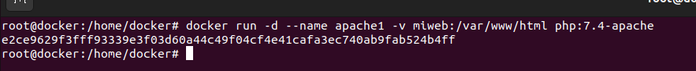

3. Utiliza el comando `docker cp` para copiar un fichero `index.html` en el directorio `/var/www/html`.

```bash
docker cp index.html apache1:/var/www/html
```

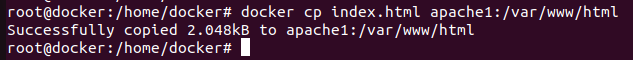

4. Accede al contenedor desde el navegador para ver la información ofrecida por el fichero `index.html.`

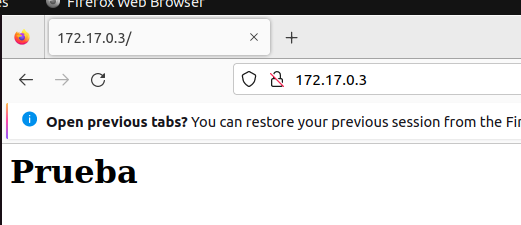

5. Borra el contenedor

   ```bash
   docker stop idcontenedor && docker rm idcontenedor
   ```

   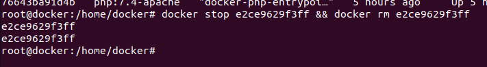

6. Crea un nuevo contenedor y monta el mismo volumen como en el ejercicio anterior.

   ```bash
   docker run -d --name apache1 -v miweb:/var/www/html php:7.4-apache
   ```

   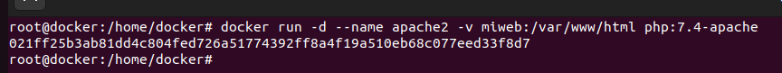

7. Accede al contenedor desde el navegador para ver la información ofrecida por el fichero `index.html`. ¿Seguía existiendo ese fichero?

   Si, al usar el mismo volumen.

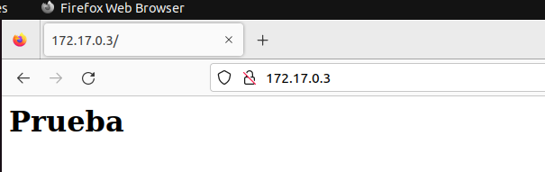


## Ejercicios de Bind Mount

1. Crea un directorio en tu host y dentro crea un fichero `index.html`.

   ```bash
   mkdir contenedor
   cd contenedor/
   nano index.html
   cat index.html
   ```

   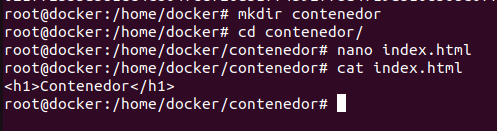

2. Crea un contenedor desde la imagen `php:7.4-apache` donde montes en el directorio `/var/www/html` el directorio que has creado por medio de `bind mount`.

```bash
docker run -d --name apache3 -v /home/docker/contenedor:/var/www/html php:7.4-apache
```

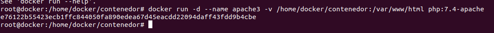

3. Accede al contenedor desde el navegador para ver la información ofrecida por el fichero `index.html`.

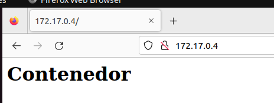

4. Modifica el contenido del fichero `index.html` en tu host y comprueba que al refrescar la página ofrecida por el contenedor, el contenido ha cambiado.

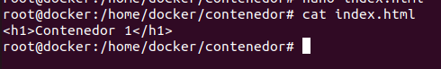

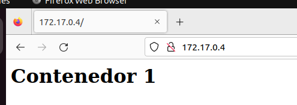