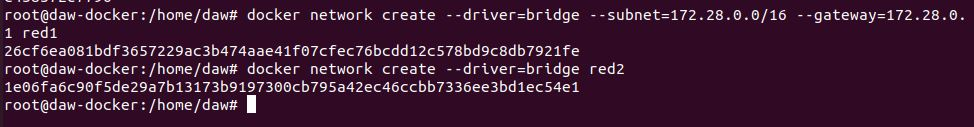
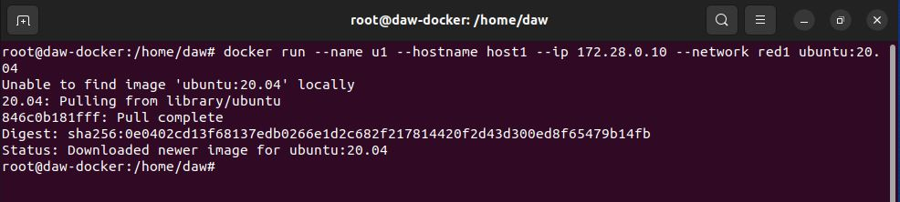
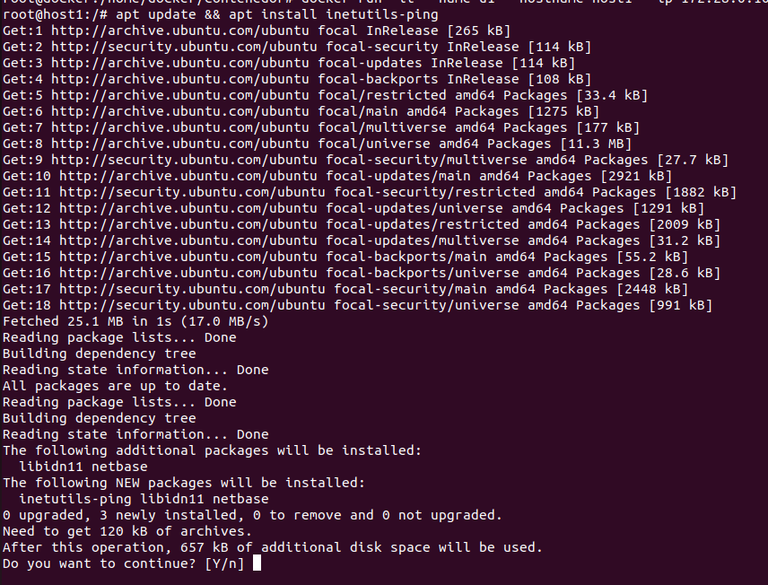
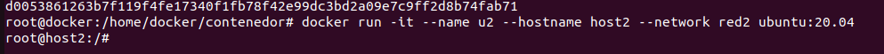
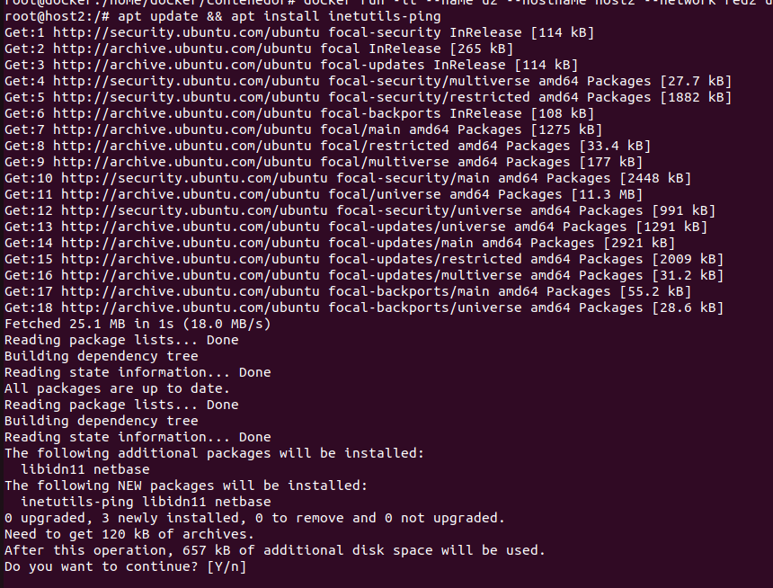
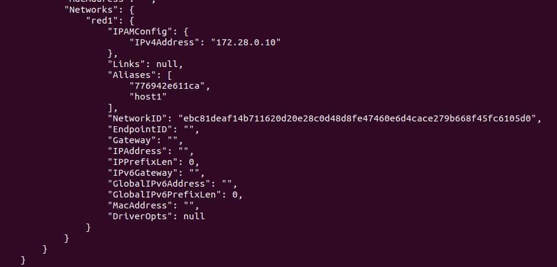
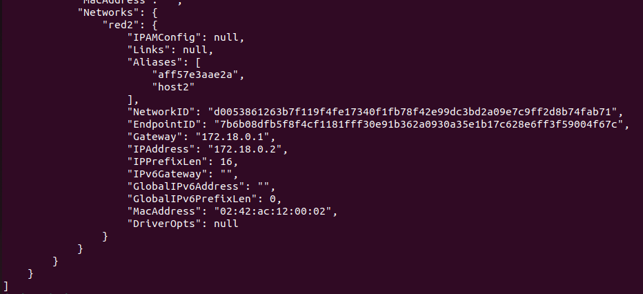

# Docker

1. Vamos a crear dos redes de ese tipo (BRIDGE) con los siguientes datos: 

   Red1 

   ​	· Nombre: red1 

   ​	· Dirección de red: 172.28.0.0 

   ​	· Máscara de red: 255.255.0.0 

   ​	· Gateway: 172.28.0.1 

   Red2 

   ​	· Nombre: red2 

   Es resto de los datos será proporcionados automáticamente por Docker.

```bash
docker network create --driver=bridge --subnet=172.28.0.0/16 --gateway=172.28.0.1 red1
```



2. Poner en ejecución un contenedor de la imagen `ubuntu:20.04` que tenga como hostname `host1` , como IP `172.28.0.10` y que esté conectado a la red1. Lo llamaremos `u1` .

   ```bash
   docker run --name u1 --hostname host1 --ip 172.28.0.10 --network red1 ubuntu:20.04
   ```



3. Entrar en ese contenedor e instalar la aplicación ping (apt update && apt install inetutils-ping).



4. Poner en ejecución un contenedor de la imagen `ubuntu:20.04` que tenga como hostname `host2` y que esté conectado a la red2. En este caso será docker el que le de una IP correspondiente a esa red. Lo llamaremos `u2`.

   ```bash
   docker run -it --name u2 --hostname host2 --network red2 ubuntu:20.04
   ```

   

5. Entrar en ese contenedor e instalar la aplicación ping (apt update && apt install inetutils-ping).



EXTRAS:

Captura de pantalla donde se vea la configuración de red de `u1`.



Captura de pantalla donde se vea la configuración de red de `u2`.



Pantallazo donde desde cualquiera de los dos contenedores se pueda ver que no podemos hacer ping al otro ni por ip ni por nombre.


Pantallazo donde se pueda comprobar que si conectamos el contenedor u1 a la red2 (con docker network connect ), desde el contenedor u1, tenemos acceso al contenedor u2 mediante ping, tanto por nombre como por ip.

